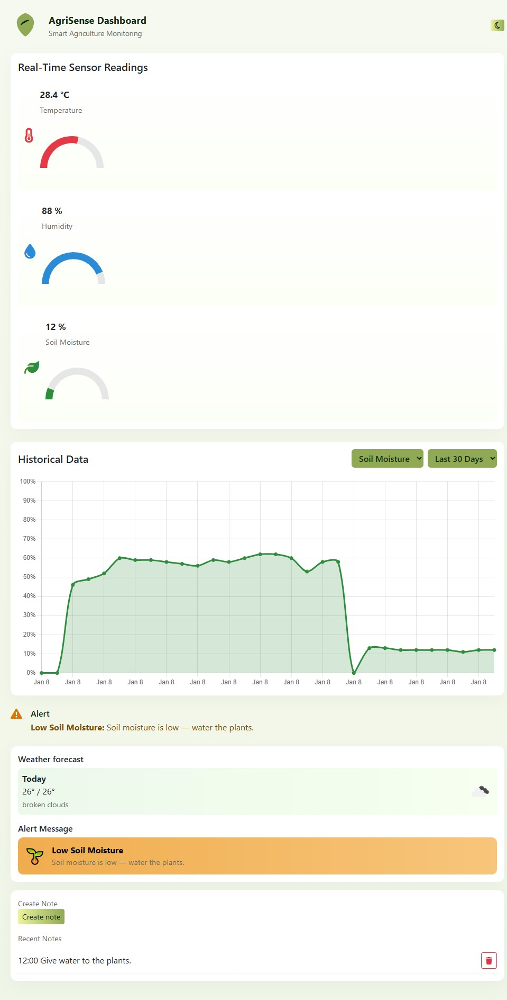
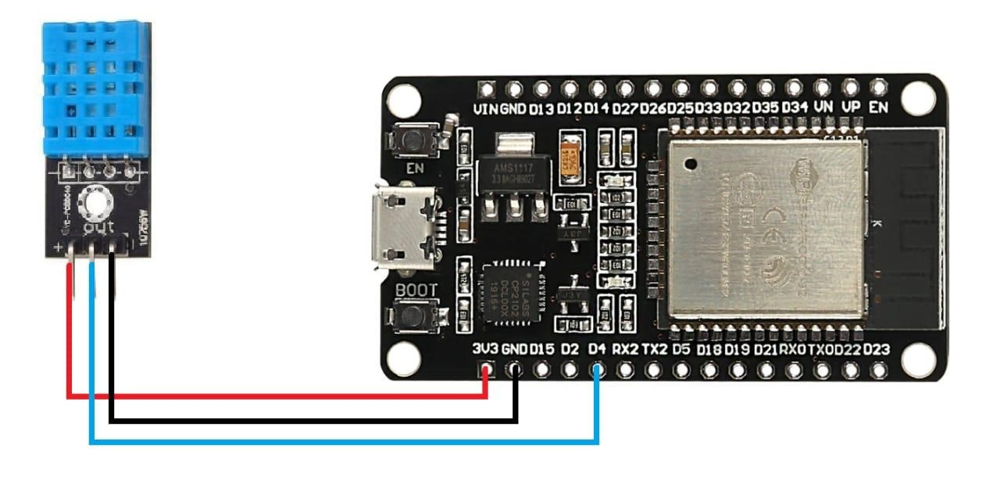
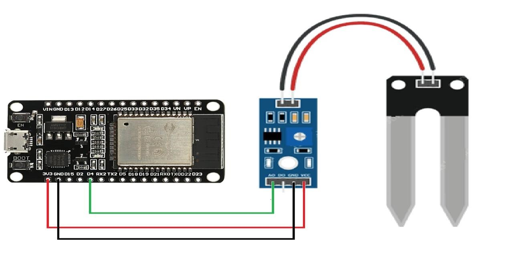

# Smart Agriculture Monitoring System 🌱

An IoT-based Smart Agriculture Monitoring System developed using ESP32, DHT22 Sensor, Soil Moisture Sensor, Firebase Realtime Database, and a responsive web dashboard built with HTML, CSS, and JavaScript.

The system monitors real-time environmental conditions such as temperature, humidity, and soil moisture, and displays the collected data through a cloud-connected dashboard.

---

## 🚀 Features

- Real-time temperature and humidity monitoring
- Soil moisture level monitoring
- Firebase Realtime Database integration
- Live web dashboard interface
- Cloud-based sensor data storage
- Responsive dashboard design
- IoT communication using ESP32

---

## 🌐 Live Demo

```bash
https://darshanworks.github.io/savora-restaurant-website/
```


## 🛠️ Technologies Used

### Hardware
- ESP32 Microcontroller
- DHT22 Sensor
- Soil Moisture Sensor
- Jumper Wires
- USB Cable

### Software
- Arduino IDE
- Firebase Realtime Database
- HTML
- CSS
- JavaScript
- Web Browser (Chrome/Edge)

---

## 📂 Project Structure

```bash
smart-agriculture-monitoring-system/
│
├── index.html
│
├── css/
│   └── style.css
│
├── js/
│   └── script.js
│
├── arduino-code/
│   └── smart_agriculture.ino
│
├── images/
│   ├── firebase-setup/
│   ├── dashboard/
│   └── hardware/
│
├── README.md
├── LICENSE
├── CONTRIBUTING.md
└── .gitignore
```

---

## ⚙️ Working Architecture

```text
Sensors → ESP32 → Firebase Realtime Database → Web Dashboard
```

1. Sensors collect environmental data.
2. ESP32 processes sensor readings.
3. Data is uploaded to Firebase Realtime Database.
4. The dashboard fetches and displays real-time data.

---

## 📸 Project Screenshots

### Dashboard

```md

```

### Hardware Connections
Add your hardware setup images here.

```md


```

---

## 🎥 Project Demo

Watch the project demo video here:

```md
https://youtu.be/7iL9VbRqE2c?si=4iuic0HAidyEg7MC
```

---

## 🔥 Firebase Configuration

Before running the project, replace the Firebase configuration inside `script.js` with your own Firebase project credentials.

Example:

```javascript
const firebaseConfig = {
  apiKey: "YOUR_API_KEY",
  authDomain: "YOUR_PROJECT.firebaseapp.com",
  databaseURL: "YOUR_DATABASE_URL",
  projectId: "YOUR_PROJECT_ID",
};
```

---

## 📌 Note

The live dashboard currently displays previously recorded sensor data because the hardware prototype is no longer connected.

---

## ▶️ How to Run the Project

### Arduino Setup
1. Open `smart_agriculture.ino` in Arduino IDE.
2. Install required ESP32 board packages and libraries.
3. Connect ESP32 board.
4. Upload the code.

### Dashboard Setup
1. Open the `dashboard` folder.
2. Configure Firebase credentials inside `script.js`.
3. Open `index.html` in your browser.

---

## 📈 Future Improvements

- Automated irrigation system
- Mobile application integration
- Sensor alert notifications
- Historical analytics dashboard
- Multi-device monitoring support

---

## 🤝 Contributing

Contributions are welcome. Feel free to fork this repository and submit pull requests.

---

## 📄 License

This project is licensed under the MIT License.